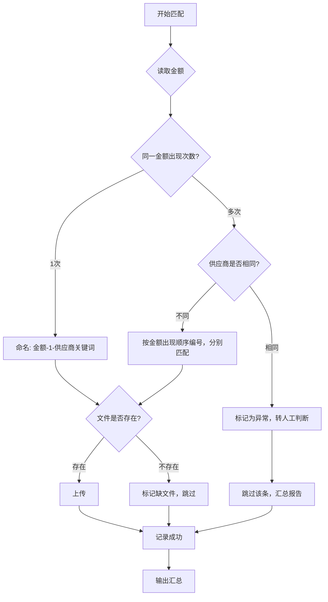

# 凭证匹配决策表

> Agent 在执行凭证与采购单匹配时，必须按本决策表逐项校验。

---

## 匹配流程

---

## 决策规则

### 1. 金额匹配
| 场景 | 决策 | 操作 |
|------|------|------|
| 唯一金额 | 直接匹配 | 金额-1-供应商关键词.jpg |
| 同金额不同供应商 | 按出现顺序编号 | 金额-1-供应商A.jpg，金额-2-供应商B.jpg |
| 同金额同供应商 | 标记人工判断 | 可能是独立凭证或重复，需人工复核 |

### 2. 供应商校验
| 校验项 | 通过条件 | 失败处理 |
|--------|----------|----------|
| 关键词匹配 | 文件名包含供应商关键词 | 检查是否为[[数据/供应商列表|供应商列表]]中的别名 |
| 易混供应商 | 确认非广信/广盛混淆 | 报错要求人工确认 |

### 3. 文件校验
| 检查项 | 条件 | 不满足时 |
|--------|------|----------|
| 文件存在 | 对应文件名在支付凭证目录存在 | 标记"缺文件" |
| 金额一致 | 文件中的凭证金额与图灵页面金额一致 | 标记"金额不符" |
| 供应商一致 | 文件名中的关键词对应正确供应商 | 标记"供应商不符" |

---

## 关联笔记
- [[报销上传规则]]
- [[数据/凭证命名规则|凭证命名规则]]
- [[数据/供应商列表|供应商列表]]
- [[AI执行指南/异常处理决策表|异常处理决策表]]
