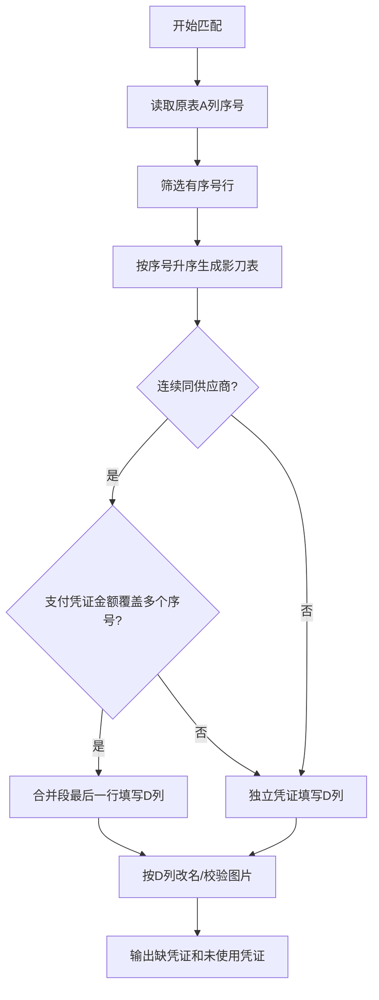

# 凭证匹配决策表

> Agent 在执行凭证与采购单匹配时，必须按本决策表逐项校验。

---

## 匹配流程

> 当前小李/影刀表格任务的主流程：先读取原表有序号的行，再生成影刀表格，最后按影刀表 D 列修改支付凭证名称。不得反过来先按凭证文件夹推断原表行。

---

## 决策规则

### 1. 金额匹配
| 场景 | 决策 | 操作 |
|------|------|------|
| 唯一金额 | 直接匹配 | `金额-供应商全称.jpg` |
| 同金额不同供应商 | 按供应商全称分别匹配 | `金额-供应商A.jpg`，`金额-供应商B.jpg` |
| 同金额同供应商 | 标记人工判断 | 可能是独立凭证或重复，需人工复核 |
| 多个连续序号合并为一张凭证 | 按支付凭证实际金额覆盖多个序号 | 只在该合并段最后一行填写 D 列凭证名 |

### 影刀表格生成顺序
1. 读取原始报销表 A 列“序号”
2. 过滤出有序号的行
3. 按序号升序写入影刀表
4. 根据连续序号、供应商和支付凭证实际金额判断是否合并
5. 根据影刀表 D 列“待上传的支付凭证名”修改支付凭证图片名称

### 易错金额校验
| 风险 | 要求 | 示例 |
|------|------|------|
| 缩略图/搜索高亮误读金额 | 必须放大凭证或 OCR/人工确认 | `370` 不能误读为 `375` |
| 文件名与凭证截图金额冲突 | 以凭证截图金额为准，修正文件名后重算影刀表 | `375-优粤纺织.jpg` 应修正为 `370-优粤纺织.jpg` |
| 凭证未被使用/缺凭证判断 | 先校验金额识别，再下结论 | 不得直接把疑似错名文件判为多余 |

### 2. 供应商校验
| 校验项 | 通过条件 | 失败处理 |
|--------|----------|----------|
| 关键词匹配 | 文件名包含供应商关键词 | 检查是否为[[数据/供应商列表|供应商列表]]中的别名 |
| 易混供应商 | 确认非广信/广盛混淆 | 报错要求人工确认 |

### 3. 文件校验
| 检查项 | 条件 | 不满足时 |
|--------|------|----------|
| 文件存在 | 对应文件名在支付凭证目录存在 | 标记"缺文件" |
| 金额一致 | 文件中的凭证金额与图灵页面金额一致 | 标记"金额不符" |
| 供应商一致 | 文件名中的关键词对应正确供应商 | 标记"供应商不符" |

---

## 关联笔记
- [[报销上传规则]]
- [[数据/凭证命名规则|凭证命名规则]]
- [[数据/供应商列表|供应商列表]]
- [[AI执行指南/异常处理决策表|异常处理决策表]]
