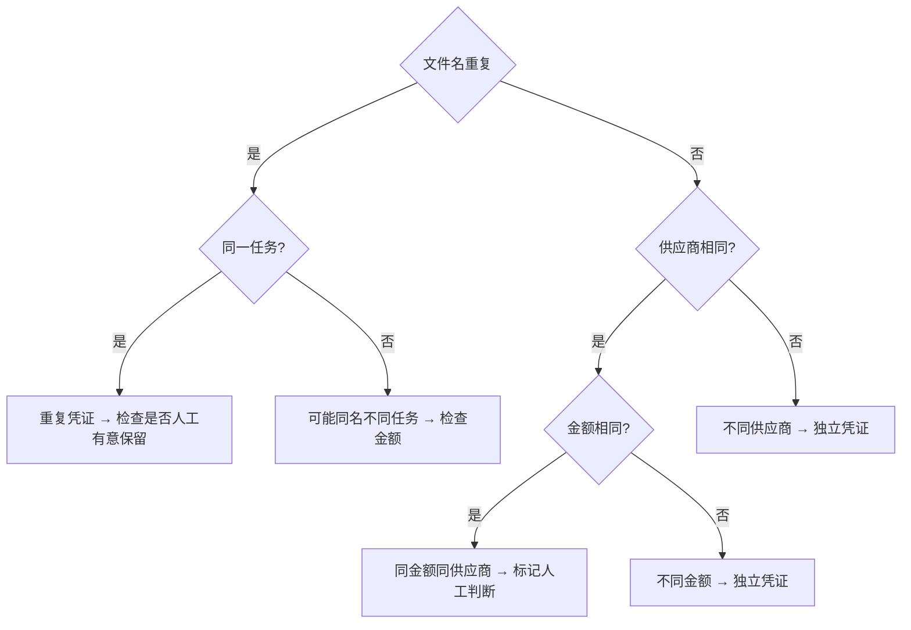

# 异常处理决策表

> Agent 遇到异常时必须按本表处理，不得自行决定。

---

## 异常分类与应对

| 异常类型 | 严重程度 | 应对策略 | 是否跳过 | 是否需要人工 |
|----------|----------|----------|----------|-------------|
| 凭证文件不存在 | 中 | 标记"缺文件：XXX" | ✅ 跳过该条 | 否（汇总报告） |
| 供应商关键词不匹配 | 高 | 检查别名、检查易混供应商 | ❌ 停止该供应商所有匹配 | ✅ 需要人工确认 |
| 同金额同供应商 | 中 | 检查是否为独立凭证 | ✅ 跳过该条 | ✅ 汇总后人工判断 |
| 金额不符 | 高 | 检查OCR结果与页面数据 | ❌ 停止该条 | ✅ 需要重新OCR或人工核对 |
| 上传后无成功反馈 | 高 | 等待3秒刷新页面确认 | ❌ 重试一次 | 重试失败后人工介入 |
| 影刀RPA识别失败 | 高 | 检查截图、检查表格结构 | ❌ 停止当前任务 | ✅ 需要修复表格 |
| 重复凭证 | 低 | 确认是否真的重复 | ✅ 跳过该条 | 汇总时标注 |
| 页面加载超时 | 中 | 刷新页面重试 | ❌ 重试最多2次 | 超3次失败后人工介入 |
| 广信/广盛混淆 | 高 | 停止当前条 | ❌ 停止 | ✅ 必须人工确认 |

---

## 到货单据更新异常

| 异常类型 | 严重程度 | 应对策略 | 是否跳过 | 是否需要人工 |
|----------|----------|----------|----------|-------------|
| 供应商单据识别失败 | 高 | 状态写为“待人工确认”，异常原因写明缺失字段 | ✅ 跳过该条 | ✅ 需要 |
| 采购单号缺失 | 高 | 不进入图灵ERP操作，写回“待人工确认” | ✅ 跳过该条 | ✅ 需要 |
| 图灵ERP无匹配采购单 | 高 | 状态写为“失败”，记录搜索条件 | ✅ 跳过该条 | ✅ 汇总确认 |
| 供应商不一致 | 高 | 停止该条，不填写数量价格 | ✅ 跳过该条 | ✅ 需要 |
| 物料或颜色不一致 | 高 | 状态写为“待人工确认”，记录页面值和任务表值 | ✅ 跳过该条 | ✅ 需要 |
| 到货数量为空或异常 | 高 | 不提交采购完成，写回异常原因 | ✅ 跳过该条 | ✅ 需要 |
| 到货价格为空或异常 | 高 | 不提交采购完成，写回异常原因 | ✅ 跳过该条 | ✅ 需要 |
| 图灵提交失败 | 高 | 重试一次；仍失败则写回“失败” | ❌ 重试一次 | ✅ 汇总确认 |
| 状态回写失败 | 高 | 不继续下一批任务，先保留当前执行结果并汇报 | ❌ 停止 | ✅ 需要 |

---

## 处理原则

1. **高优先级停止原则**：涉及到金钱/供应商等核心数据不匹配，一律停止并人工确认
2. **跳过原则**：文件缺失或明显可跳过的异常，标记后继续
3. **重试原则**：网络/系统类异常，最多重试2次
4. **汇总原则**：完成任务后，将所有异常统一汇总报告
5. **状态回写原则**：到货单据更新任务必须写状态回任务表，不能只完成页面操作

---

## 凭证重复判断

---

## 关联笔记
- [[报销上传规则]]
- [[AI执行指南/凭证匹配决策表|凭证匹配决策表]]
- [[数据/供应商列表|供应商列表]]
