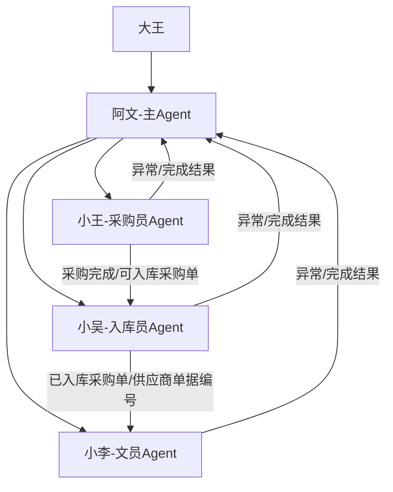

# ai采购流程

> 统一口径：这个项目不新建一套“主 Agent / 采购员 Agent / 文员 Agent”的平行命名。知识库主 Agent 就是 [[团队/阿文|阿文]]；采购员 Agent 是 [[团队/小王|小王]]；入库员 Agent 是 [[团队/小吴|小吴]]；文员 Agent 是 [[团队/小李|小李]]。

---

## 统一 Agent 路由

| 项目角色 | 固定 Agent | 清理后的口径 |
|------|------|------|
| 主 Agent / 调度者 | [[团队/阿文|阿文]] | 不再另起平行主控 |
| 采购员 Agent | [[团队/小王|小王]] | 三表生成只是工具能力 |
| 入库员 Agent | [[团队/小吴|小吴]] | 统一为小吴 |
| 文员 Agent | [[团队/小李|小李]] | 统一为小李 |

---

## 阿文职责

阿文是 `ai采购流程` 的主 Agent。

- 给小王、小吴、小李发命令。
- 统计三个子 Agent 的执行结果。
- 接收异常反馈。
- 判断下一步：重试、跳过、转人工确认、切换 Agent、停止链路。
- 维护项目任务表和异常表。

当前状态：尚未实现统一调度器，需要开发。

---

## 小王职责：采购员 Agent

三表生成是小王职责中的一个工具能力，不作为独立路线。

### 接单 / 下单

1. 从图灵“全部”下载待下单和待供应商接单数据。
2. 调用 `版料采购单生成三表_backup_20260602_162549.bat` 整理信息。
3. 根据 `D:\app\自动化流程\供应商微信映射表.xlsx` 判断是否需要发微信。
4. 给需要通知的供应商发送微信。
5. 对已经发送的采购单，在待下单页面点击“下单”。
6. 如果没有采购员，转派采购员为“王国钦”。

执行口径：
- 小王必须从第 1 步开始跑完整链路，不直接拿历史三表下单。
- 影刀负责微信发送，并回写三表 `待发供应商信息` 的 `发送状态`、`发送时间`。
- 小王只对 `发送状态=已发送` 且 `采购状态=待下单` 的供应商执行图灵下单；`未发送`、待补联系人、待供应商接单不下单。
- 图灵下单首轮失败时自动二次重试一次；二次仍失败才作为异常回报阿文。

### 回货签收 / 采购完成

1. 查看 `D:\报销工作台\01_供应商单据` 的供应商单据文件。
2. 小王核对供应商单据与采购单号、实际采购数量、实际采购单价。
3. 小王更新 `D:\报销工作台\04_WorkBuddy任务\WorkBuddy采购入库任务表.xlsx` 的 `入库明细`，已核对清楚的记录标为 `待执行`，缺数量/单价或对应关系不清的记录标为 `待确认`。
4. 影刀读取入库任务表，进入图灵待供应商接单或待收货页面点击“采购完成”。
5. 影刀录入实际采购数量和实际采购单价，点击提交，并执行打印标签。
6. 影刀回写系统执行结果或由阿文/小王根据结果更新任务状态。

2026-06-27 防呆补充：
- 回货签收做表必须区分“采购单号已匹配”和“数量/单价已可执行”。只确认了采购单号，但单位、数量、单价还要换算时，先标 `待确认`；用户给出口径后再推进 `待执行`。
- 写入 `WorkBuddy采购入库任务表.xlsx` 前后都要备份和回读校验。回读至少检查：采购单号、供应商、物料、颜色/色号、本次入库数量、实际单价、任务状态、备注是否中文正常。
- 不能用会丢中文编码的 PowerShell 临时脚本直接写 Excel。中文数据必须经 UTF-8 文件或稳定的 `.py` 脚本写入；发现 `?` 说明文件内容已被写坏，必须立即用备份或 UTF-8 脚本修复。
- 追加 Excel 时不能依赖 `ws.max_row`，因为 WorkBuddy 表可能有预留空白格式行；要按关键列找第一个真实空行。
- 多行供应商单据要拆成多条入库明细；不要把一张图中的多个颜色压成一条 OCR 记录。
- 旧单、用户明确说“先不用管”的单据，必须从本次执行范围排除。
- 宝年丰布业按公斤开销售单时，最终给影刀的是米价：先按用户确认的米数和供应商单据金额折算，备注换算依据，再写 `实际单价`。

当前状态：小王已补齐“自动登录/进入图灵采购单管理并下载待下单、待供应商接单数据”“识别供应商微信映射表中的无需发送微信供应商”“读取三表 `待发供应商信息` 中的发送状态/发送时间，已发送后继续图灵下单”“待下单页面按采购单勾选、空采购员转派王国钦、批量下单”“供应商单据扫描识别入口”“回货签收 / 采购完成做表能力”。2026-06-22 已用宝年丰布业 `BNF2606180279` 测试过采购完成提交链路，但新分工下图灵采购完成、提交和打印标签交给影刀，小王只做到核对并更新入库任务表。三表生成、微信映射、到货处理文件可复用。微信发送由影刀负责，小王不直接点击微信发送。供应商单据 OCR 不完整时进入 `待Agent识别`；做表时只把能唯一确定 `采购单号 / 实际采购数量 / 实际采购单价 / 来源单据` 且差异原因已确认的记录标为 `待执行`。

---

## 小吴职责：入库员 Agent

小吴负责入库和齐套出库，不再只作为“全局状态表同步脚本”的附属角色。

### 送货入库

1. 接收小王同步的待入库采购单。
2. 到送货入库页面。
3. 把采购编号复制到“关联单据”。
4. 点击入库。
5. 点击确认。

### 待齐套 / 出库

1. 到版料需求页面。
2. 在需求状态筛选“待齐套”。
3. 复制需求页面“设计款/版型”。
4. 到出库页面，把设计款/版型填入搜索。
5. 检查领料状态是否齐套。
6. 如果包含“待提交”或“已提交”，不能出库，必须回报阿文。
7. 已齐套时点击打印 BOM 和版单图。
8. 对已齐套的出库单点击确认收货。

当前状态：送货入库已有 `purchase_auto_inbound.py` 可改造接入；齐套、出库、打印 BOM、打印版单图、确认收货仍需开发。

---

## 小李职责：文员 Agent

小李负责文员报销链路。

1. 接收小吴给出的已入库供应商单据编号。
2. 整理支付凭证。
3. 把已入库的供应商单据编号做成报销任务表。
4. 根据小王/小吴链路生成的表格，按顺序在版料报销页面创建报销单。
5. 报销人填写“王国钦”。
6. 添加采购记录。
7. 点击添加。
8. 上传支付凭证。
9. 上传完毕后点击完成。

当前状态：`clerk_agent.py + turing_reimb.py` 已覆盖大部分报销页面自动化；缺口是“从已入库供应商单据编号自动生成报销任务表”。

---

## 现有脚本能力盘点

### 可直接复用

| 能力        | 脚本/文件                                                                                               | 归属 Agent | 覆盖范围                                        | 缺口                            |
| --------- | --------------------------------------------------------------------------------------------------- | -------- | ------------------------------------------- | ----------------------------- |
| 小王采购下载入口 | `D:\报销工作台\03_脚本\xiaowang_agent.py` | 小王 | 自动登录/进入图灵采购单管理，按“待下单、待供应商接单”分别导出，并合并为当天标准 `版料采购单YYYY年MM月DD日.xlsx` | 只下载和合并数据，不做微信发送、下单点击、采购完成 |
| 小王待下单处理入口 | `D:\报销工作台\03_脚本\xiaowang_agent.py --submit-pending-orders` | 小王 | 进入“待下单”页面，切到“按采购单”，按采购单号搜索并勾选；采购员为空时先转派“王国钦”；之后点击“批量下单” | 不处理待供应商接单下单；不做微信发送、采购完成、打印标签 |
| 小王供应商单据识别入口 | `D:\报销工作台\03_脚本\xiaowang_agent.py --scan-supplier-docs --dry` | 小王 | 扫描 `D:\报销工作台\01_供应商单据`，默认优先调用 Umi-OCR；识别采购单、实际数量、实际单价；输出 `xiaowang_supplier_doc_scan.json`；已知 Umi 无效的批次可用 `--ocr-engine easyocr` 跳过 Umi | 识别不全则标记 `待Agent识别`，不提交图灵；Umi 单图超时保持低值，避免拖节奏 |
| 小王采购完成做表入口 | `D:\报销工作台\03_脚本\xiaowang_agent.py --complete-purchases` / 手工核对后更新 `WorkBuddy采购入库任务表.xlsx` | 小王 | 核对供应商单据、采购单号、实际采购数量、实际采购单价，更新 `入库明细`；清楚的标 `待执行`，不清楚的标 `待确认` | 图灵里的采购完成、提交、打印标签由影刀执行；小王不直接点业务按钮 |
| 版料采购单生成三表 | `C:\Users\Administrator\Desktop\版料采购单生成三表_backup_20260602_162549.bat` / `D:\app\自动化流程\版料采购单生成三表.py` | 小王       | 将导出的版料采购单整理为 Sheet1、版料采购单管理、待发供应商信息、待补联系人；可识别“无需发送微信”供应商   | 不负责微信发送          |
| 小吴同步全局状态表 | `D:\报销工作台\03_脚本\sync_xiaowu_global_status.py`                                                       | 小吴       | 将最新原始版料采购单同步到全局状态表的“图灵采购明细表”                | 只是同步脚本，不等于完整入库员 Agent         |
| 入库确认复刻脚本  | `C:\Users\Administrator\.workbuddy\skills\yingdao-rpa\purchase_auto_inbound.py`                     | 小吴       | 连接已登录 Chrome，抓取待入库单号，到送货入库页面逐个搜索并点击入库确认     | 未接入小王给出的待入库清单；未与阿文调度表联动       |
| 报销页面自动化封装 | `D:\报销工作台\03_脚本\turing_reimb.py`                                                                    | 小李       | 图灵版料报销页：登录、创建/查找报销单、添加采购记录、上传凭证、保存/提交       | 依赖报销任务表                       |
| 文员批量报销主脚本 | `D:\报销工作台\03_脚本\clerk_agent.py`                                                                     | 小李       | 读取 WorkBuddy 报销任务表，按任务执行报销创建/上传/回写          | 前置任务生成逻辑还要补                   |
| 报销任务读写    | `D:\报销工作台\03_脚本\task_writer.py`                                                                     | 小李       | 读取、筛选、分组、回写 WorkBuddy 报销任务表                 | 只服务报销任务                       |
| 报销复刻脚本    | `C:\Users\Administrator\.workbuddy\skills\yingdao-rpa\expense_reimbursement.py`                     | 小李       | 根据 Excel 创建报销单、添加采购记录、上传凭证，默认 `strict=True` | 与 `clerk_agent.py` 重叠，作为备用/参考 |

### 可部分复用

| 能力 | 脚本/文件 | 归属 Agent | 可复用部分 | 不足 |
|------|------|------|------|------|
| 到货采购单处理 | `D:\app\自动化流程\版料采购到货处理.py` | 小王 | 读取到货清单、匹配供应商价格表、生成到货处理文件 | 历史辅助脚本；主入口改为 `xiaowang_agent.py` |
| 采购单转影刀格式 | `D:\app\自动化流程\版料采购单转影刀格式.py` | 小李/历史工具 | 将有序号采购单转换为影刀数据表格格式 | 主要用于旧报销/影刀格式，不作为采购主链路 |
| 已齐套勾选辅助 | `D:\app\自动化流程\click_ready_to_pick_checkboxes.py` | 小吴 | 可识别领料列表中“已齐套”的行并勾选 | 只是影刀 API 辅助函数，不是完整小吴流程 |
| WorkBuddy 采购入库任务表 | `D:\报销工作台\04_WorkBuddy任务\WorkBuddy采购入库任务表.xlsx` | 小王 -> 小吴 | 可作为采购员到入库员交接表 | 缺少自动写入、读取、回写脚本 |

### 当前只是骨架

| Agent | 脚本 | 处理方式 |
|------|------|------|
| 小王 | `D:\报销工作台\03_脚本\xiaowang_agent.py` | 已具备采购单下载、待下单批量下单、空采购员转派、供应商单据识别、采购完成、打印标签尝试、小吴任务表写入入口；后续继续补微信发送 |
| 小吴 | `D:\报销工作台\03_脚本\xiaowu_agent.py` | 保留为入库员 Agent 主入口，后续填充业务逻辑 |

---

## 当前缺口

### 阿文缺口

1. 缺少统一项目调度器。
2. 缺少小王、小吴、小李的标准任务协议。
3. 缺少异常回流表或异常队列。
4. 缺少“异常 -> 下一步指令”的决策规则。
5. 缺少跨 Agent 状态汇总报表。

### 小王缺口

已补齐：
1. 自动登录/进入图灵采购单管理，并下载待下单、待供应商接单数据。
2. 自动识别供应商微信映射表中的“无需发送微信”供应商。
3. 进入待下单页面，按采购单搜索并勾选，点击批量下单。
4. 采购员为空时自动转派“王国钦”。
5. 供应商单据图片扫描入口：默认优先 Umi-OCR，识别不全转 `待Agent识别`；如果某批次 Umi-OCR 已确认识别不出内容，改用 `--ocr-engine easyocr` 或直接人工核对，不再长时间等待。
6. 采购完成入口：优先待收货，找不到再待供应商接单，录入实际采购数量/单价，提交并尝试打印标签。
7. 采购完成成功后写入小吴任务表。

仍待开发：
1. 自动发送微信给供应商。
2. 将 `待Agent识别` 的供应商单据自动匹配到采购单号的智能规则继续增强。

### 小吴缺口

1. 从小王交接表读取待入库采购编号，并按任务状态执行。
2. 送货入库脚本接入任务表和阿文调度。
3. 版料需求页面筛选“待齐套”。
4. 需求页面“设计款/版型”复制到出库页面。
5. 领料状态包含“待提交/已提交”时阻断出库。
6. 打印 BOM、打印版单图。
7. 已齐套出库确认收货。

### 小李缺口

1. 从已入库供应商单据编号自动生成报销任务表。
2. 将供应商单据、支付凭证、采购单号、凭证组号自动串联。
3. 统一主链路为 `clerk_agent.py + turing_reimb.py`；`expense_reimbursement.py` 作为复刻参考/备用。
4. 上传完成后“点击完成”的具体按钮和回写状态需要和当前图灵页面再校验。

---

## 实现度总结

| 模块 | 当前实现度 | 说明 |
|------|------|------|
| 阿文调度 | 0% | 尚无统一调度和异常回流 |
| 小王采购链路 | 约 60% | 采购单下载、三表生成、微信映射、无需发送微信识别、待下单批量下单、空采购员转派、供应商单据扫描、采购完成入口、小吴任务表写入可用；微信发送和智能匹配增强仍未实现 |
| 小吴入库链路 | 约 30% | 入库确认脚本可用；齐套、出库、打印 BOM/版单图未实现 |
| 小李文员链路 | 约 65% | 报销页面自动化和任务表执行已有；任务生成和全链路接入仍需开发 |
| 数据底座 | 约 70% | 全局状态表、供应商单据表、凭证组表、采购入库任务表、报销任务表已存在 |

粗略统计：

- 可直接复用的脚本/资产：7 个。
- 可部分复用的脚本/资产：4 个。
- 需要新开发的关键能力：约 20 项。

---

## 合并和删除结果

- 合并“主 Agent”到 [[团队/阿文|阿文]]。
- 合并“采购员 Agent”到 [[团队/小王|小王]]。
- 合并“文员 Agent”到 [[团队/小李|小李]]。
- 明确“小王不是仅三表生成 Agent”，三表生成只是小王采购工作里的工具能力。
- 新增 [[团队/小吴|小吴]] 作为入库员 Agent，承接原本散落的“小吴同步”和入库职责。
- 删除概念上的重复路线：不再单独维护一套泛称体系，全部并入阿文、小王、小吴、小李。

---

## 建议开发顺序

1. 阿文：定义主任务表、异常表、子 Agent 指令格式。
2. 小王：先实现“导出数据 -> 三表 -> 待发供应商信息 -> 下单任务表”。
3. 小王：补微信发送和图灵下单。
4. 小王：补采购完成、数量单价录入、打印标签，并写入小吴任务表。
5. 小吴：接入 `purchase_auto_inbound.py`，按小王任务表入库。
6. 小吴：补齐待齐套、出库、打印 BOM/版单图、确认收货。
7. 小李：从小吴已入库结果生成报销任务表。
8. 阿文：汇总小王、小吴、小李执行结果，形成异常闭环。

---

## 关联笔记

- [[团队/阿文|阿文]]
- [[团队/小王|小王]]
- [[团队/小吴|小吴]]
- [[团队/小李|小李]]
- [[系统/WorkBuddy系统|WorkBuddy系统]]
- [[系统/影刀RPA|影刀RPA]]
- [[系统/图灵ERP|图灵ERP]]
- [[技术/WorkBuddy RPA复刻审查|WorkBuddy RPA复刻审查]]
