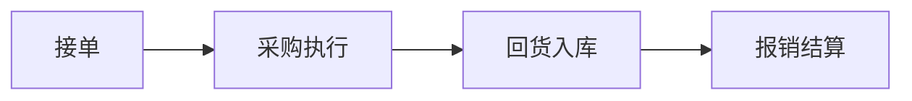

# 业务流程总览

> 面料部核心业务流程一览

---

## 三大主流程

---

## 1. 接单流程

每天从图灵ERP下载待接单文件 → 脚本生成微信消息 → 人工审核 → 隐刀RPA发送微信群

详见：[[接单流程]]

## 2. 回货流程

收到面料 → 打印销售单 → 手写采购单号 → 图灵ERP填到货数量/价格 → 打印标签

自动化到货单据更新：识别供应商单据 → 更新任务表 → 影刀操作图灵ERP → 操作完毕写状态回表格

详见：[[回货流程]]

## 3. 报销流程

上传凭证 → AI OCR → 影刀表格 → 图灵上传 → 人工核对 → 飞书合思

详见：[[报销流程]]

---

## 关键系统入口

| 系统 | 地址 |
|------|------|
| 图灵ERP | `https://turing.patpat.shop/` |
| 版料采购板块 | `turing.patpat.shop/mrp/supply-chain/surface-accessories-m-r-p/plate-material-management/` |

---

## 团队分工

- **大王**：面料部唯一主管，负责全流程决策
- **王国庆**：文员，协助日常事务
- **阿文**：AI军师兼管家，负责思路梳理、自动化开发指导
- **小李**：AI文员Agent，负责凭证匹配等文员任务
