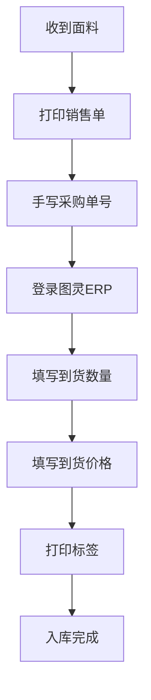
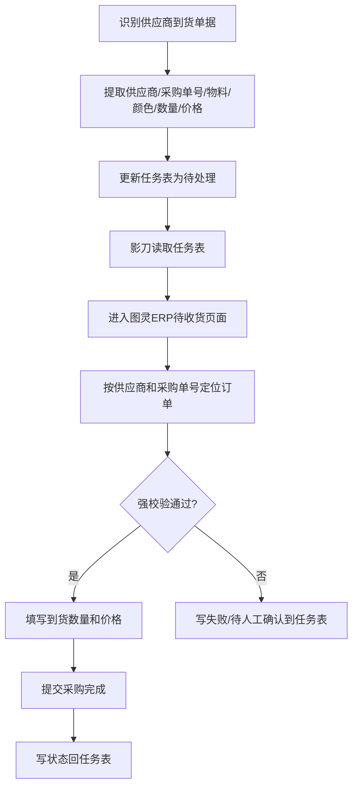

# 回货流程

> 面料到货后的入库处理流程

---

## 流程图

---

## 自动化到货单据更新链路

当任务来自供应商到货单据识别时，流程按“任务表驱动”执行：

这条链路与人工回货流程关联，但核心控制点是：**任务表必须记录每一条单据的执行状态**。

---

## 详细步骤

### Step 1：接收面料
- 供应商送货到仓库
- 核对送货单与采购单信息

### Step 2：打印销售单
- 从系统打印对应的销售单据

### Step 3：手写采购单号
- 在销售单上手写标注对应的采购单号
- 便于后续在图灵ERP中查找

### Step 4：图灵ERP录入
- 进入图灵ERP → 供应链 → 面辅料MRP → 版料管理
- 在待收货页面找到对应采购单
- 填写到货数量（核对实际收货数量）
- 填写到货价格（核对采购价格）
- 如果由影刀执行，必须先从任务表读取“待处理”行，执行完成后写状态回任务表

### Step 5：打印标签
- 图灵ERP生成标签
- 打印并贴到对应面料上

### Step 6：状态回写
- 成功：任务表状态写为“成功”，记录操作时间
- 失败：任务表状态写为“失败”，填写异常原因
- 不确定：任务表状态写为“待人工确认”，不得继续提交

---

## 关键校验节点

采购入库任务执行时需逐项核验：
1. 采购单号
2. 供应商
3. 状态（是否待收货）
4. 物料
5. 颜色

全部校验通过后方可提交确认。

## 任务表状态规则

| 状态 | 含义 | 下一步 |
|------|------|--------|
| 待处理 | 影刀可读取并执行 | 进入图灵ERP操作 |
| 成功 | 图灵ERP已完成更新 | 人工抽查或归档 |
| 失败 | 系统操作失败或数据不匹配 | 查看异常原因 |
| 待人工确认 | 信息不足或强校验未通过 | 大王/人工确认后再处理 |

---

## 关联系统

- [[系统/图灵ERP|图灵ERP]] — 到货录入与标签打印
- [[业务/接单流程|接单流程]] — 上游流程
- [[业务/报销流程|报销流程]] — 下游流程
- [[AI执行指南/自动化任务输入输出模板|自动化任务输入输出模板]] — 任务表输入输出模板
- [[AI执行指南/异常处理决策表|异常处理决策表]] — 异常状态回写规则
