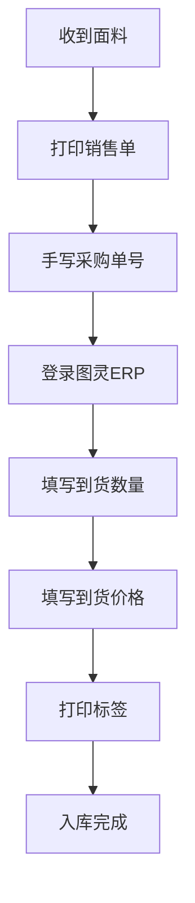

# 回货流程

> 面料到货后的入库处理流程

---

## 流程图

---

## 详细步骤

### Step 1：接收面料
- 供应商送货到仓库
- 核对送货单与采购单信息

### Step 2：打印销售单
- 从系统打印对应的销售单据

### Step 3：手写采购单号
- 在销售单上手写标注对应的采购单号
- 便于后续在图灵ERP中查找

### Step 4：图灵ERP录入
- 进入图灵ERP → 供应链 → 面辅料MRP → 版料管理
- 在待收货页面找到对应采购单
- 填写到货数量（核对实际收货数量）
- 填写到货价格（核对采购价格）

### Step 5：打印标签
- 图灵ERP生成标签
- 打印并贴到对应面料上

---

## 关键校验节点

采购入库任务执行时需逐项核验：
1. 采购单号
2. 供应商
3. 状态（是否待收货）
4. 物料
5. 颜色

全部校验通过后方可提交确认。

---

## 关联系统

- [[系统/图灵ERP|图灵ERP]] — 到货录入与标签打印
- [[业务/接单流程|接单流程]] — 上游流程
- [[业务/报销流程|报销流程]] — 下游流程
