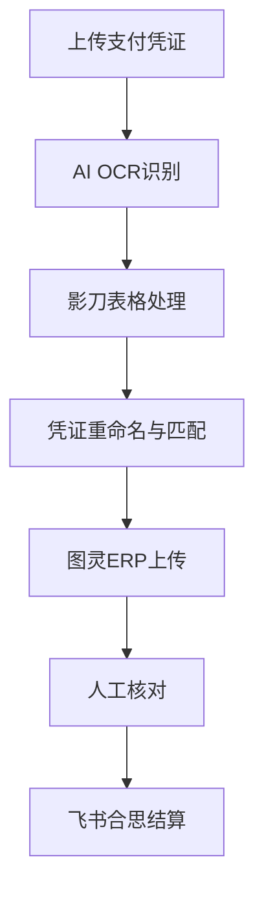

# 报销流程

> 支付凭证处理与报销结算

---

## 流程图



---

## 详细步骤

### Step 1：上传凭证
- 支付凭证（银行转账截图、微信/支付宝支付截图）
- 整理到指定文件夹

### Step 2：AI OCR识别
- 识别凭证中的关键信息：金额、供应商、日期
- 数据写入xlsx表格

### Step 3：影刀表格处理
- 从原表 A 列“序号”筛出有序号的行
- 按序号升序生成 11 列影刀格式 Excel
- 根据连续序号、供应商和支付凭证实际金额判断是否多个序号合并一张凭证

### Step 4：凭证重命名与匹配
- 命名规则：`金额-供应商全称.jpg`
- 同金额同供应商多张独立凭证时，第二张起使用 `金额-2-供应商全称.jpg`
- 多个连续序号共用一张凭证时，只在影刀表 D 列最后一行填写凭证名
- 金额必须以支付凭证截图/OCR/人工确认为准，370/375 等相近数字需放大核验

详见：[[数据/凭证命名规则|凭证命名规则]]

### Step 5：图灵ERP上传
- 将匹配好的凭证上传到图灵ERP对应采购单
- 通过采购单号关联使用部门

### Step 6：人工核对
- 大王核对上传结果
- 确认金额、供应商、采购单号匹配正确

### Step 7：飞书合思结算
- 最终在飞书合思系统完成报销结算

---

## AI+影刀协作模式

```
AI处理数据 → 写入xlsx → 影刀RPA接手执行
```

AI负责智能匹配和数据处理，影刀负责重复性UI操作。

执行报销自动化任务前，Agent应先读取[[AI执行指南/Agent读取顺序|Agent读取顺序]]，再按[[AI执行指南/自动化任务输入输出模板|自动化任务输入输出模板]]汇报结果。

---

## 关联系统

- [[系统/影刀RPA|影刀RPA]] — 表格处理和凭证操作
- [[系统/图灵ERP|图灵ERP]] — 凭证上传
- [[技术/自动化报销系统|自动化报销系统]] — Python自动化脚本
- [[团队/小李|小李]] — AI文员Agent处理凭证匹配
- [[AI执行指南/凭证匹配决策表|凭证匹配决策表]]
