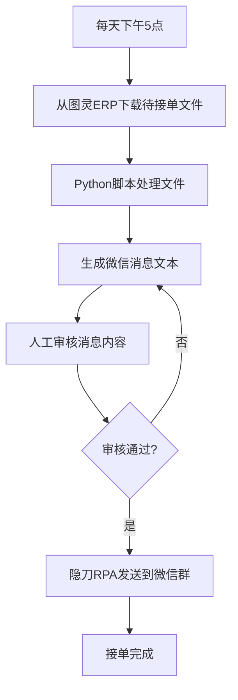

# 接单流程

> 每天从图灵ERP下载待接单文件并分发到微信群

---

## 流程图

---

## 详细步骤

### Step 1：下载待接单文件
- 登录图灵ERP
- 进入：供应链 → 面辅料MRP → 版料管理 → 采购管理列表
- 下载当日待接单的采购订单

### Step 2：脚本生成消息
- 使用 Python 脚本解析下载的文件
- 按供应商/采购单号组织消息格式
- 生成可发送的微信消息文本

### Step 3：人工审核
- 大王核对采购单号、供应商、数量、价格
- 确认无误后批准发送

### Step 4：隐刀RPA发送
- 隐刀RPA读取消息文本
- 自动发送到对应的微信群组

---

## 关联系统

- [[系统/图灵ERP|图灵ERP]] — 下载待接单文件
- [[系统/影刀RPA|隐刀RPA]] — 微信消息发送
