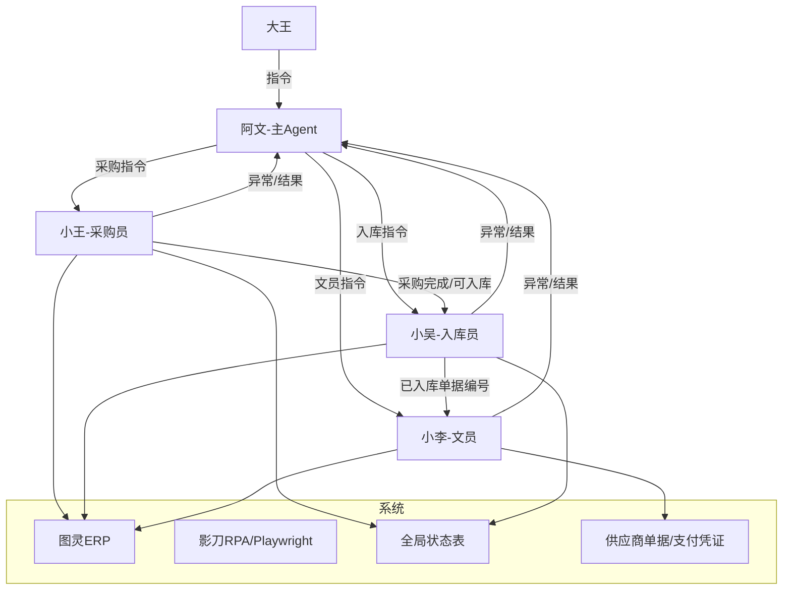
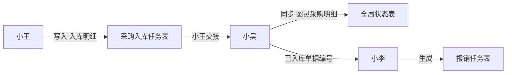

# 多Agent协作

> WorkBuddy 多智能体协同方案。当前统一为：阿文统筹，小王采购，小吴入库，小李文员。

---

## 当前 Agent 架构



---

## Agent 角色定义

### 阿文

- **定位**：主 Agent、军师兼管家。
- **触发**：呼叫"阿文"或"小文"。
- **能力**：思路梳理、技术方案、复盘总结、知识管理、自动化开发、子 Agent 调度。
- **在 ai采购流程中的职责**：发命令、汇总结果、处理异常、给小王/小吴/小李下下一步指令。

### 小王

- **定位**：采购员 Agent。
- **触发**：呼叫"小王"。
- **能力**：接单、下单、供应商微信沟通、回货签收、采购完成、打印标签、版料采购单三表生成。
- **边界**：小王负责采购侧，不负责入库出库，不负责报销上传。

### 小吴

- **定位**：入库员 Agent。
- **触发**：呼叫"小吴"。
- **能力**：全局状态同步、送货入库、待齐套检查、出库、打印 BOM/版单图、确认收货。
- **边界**：小吴负责入库/出库侧，不负责采购下单，不负责报销上传。

### 小李

- **定位**：文员 Agent。
- **触发**：呼叫"小李"。
- **能力**：供应商单据编号整理、支付凭证整理、凭证匹配重命名、报销任务表生成、图灵报销页面上传。
- **边界**：小李负责文员报销侧，不负责采购下单，不负责入库出库。

---

## 合并后的协作模式

```text
大王 -> 阿文 -> 小王/小吴/小李
小王/小吴/小李 -> 异常和结果回流给阿文
阿文 -> 根据异常类型继续下指令
```

不再维护以下重复路线：

- 独立“主Agent”路线：已合并为阿文。
- 独立“采购员Agent”泛称：已合并为小王。
- 独立“文员Agent”泛称：已合并为小李。
- 小王的旧主身份已合并到采购员 Agent；三表生成保留为工具能力。

---

## 开发实现（形态 / 数据流 / 调度）

> 本章回答"这套多 Agent 协作到底怎么落地"：每个 Agent 用什么形态承载、Agent 之间靠什么传数据、阿文怎么下发指令与回收结果。

### 各 Agent 的实现形态

| Agent | 落地形态 | 载体 / 入口 | 状态 |
|------|----------|-------------|------|
| 阿文（主） | 系统身份 | `C:\Users\Administrator\.workbuddy\SOUL.md` / `IDENTITY.md` | ✅ 已落地 |
| 小王（采购） | Python CLI 脚本 | `D:\报销工作台\03_脚本\xiaowang_agent.py` | ✅ 已落地（微信发送 / 图灵采购完成由影刀负责） |
| 小吴（入库） | Python CLI 脚本 | `D:\报销工作台\03_脚本\xiaowu_agent.py`（主入口骨架）+ `sync_xiaowu_global_status.py` | 🔄 半落地（sync 可用，主入口待开发，见 [[团队/小吴\|小吴]] 开发草案） |
| 小李（文员） | WorkBuddy 技能 | `xiaoli-voucher` 技能 + [[报销上传规则\|报销上传规则]] | ✅ 已落地 |
| 影刀复刻 | WorkBuddy 技能 | `yingdao-rpa`（`purchase_auto_inbound.py` / `expense_reimbursement.py`） | ✅ 已落地 |

> ⚠️ **形态不统一是当前最大技术债**：阿文是系统身份，小王/小吴是 Python CLI，小李/影刀是 WorkBuddy 技能。归一化方案见 [[技术/多Agent协作\|C 统一调度中枢]]。

### Agent 间数据流（任务表作为消息总线）

Agent 之间**不直接互相调用**，而是读写共享的 Excel 任务表，形成"消息总线"。谁生产、谁消费一目了然：



| 数据载体 | 路径 | 生产者 | 消费者 |
|----------|------|--------|--------|
| 采购入库任务表 | `D:\报销工作台\04_WorkBuddy任务\WorkBuddy采购入库任务表.xlsx`（入库明细） | 小王（回货签收做表） | 小吴（入库） |
| 全局状态表 | `D:\报销工作台\00_全局状态表\全局状态表.xlsx`（图灵采购明细表） | 小吴（sync） | 阿文 / 小王（核对） |
| 已入库单据编号 | 小吴交接清单 | 小吴 | 小李（报销） |
| 报销任务表 | 小李生成 | 小李 | 图灵报销上传 |

### 调度协议（阿文 ↔ 子 Agent）

1. **阿文下发指令**：自然语言 + 指定任务文件（xlsx）路径，明确目标 Agent 与任务类型。
2. **子 Agent 执行**：严格按 [[AI执行指南/Agent读取顺序\|Agent读取顺序]] 读规则 → 读决策表 → 执行 → 写状态回任务表。
3. **子 Agent 回报**：按 [[AI执行指南/自动化任务输入输出模板\|自动化任务输入输出模板]] 输出（任务摘要 / 成功明细 / 异常明细 / 待人工）。
4. **异常回流**：遇高优先级异常按 [[AI执行指南/异常处理决策表\|异常处理决策表]] 停止并回报阿文；阿文判断下一步（重试 / 跳过 / 转人工 / 切换 Agent / 停止链路）。
5. **固定路由**：采购 → 小王，入库 → 小吴，文员 → 小李（见 [[团队/阿文\|阿文]] 固定路由表）。

### 路由与当前路线图

| 阶段 | 内容 | 状态 |
|------|------|------|
| 设计 | 四 Agent 角色 / 边界 / 架构 | ✅ 已完成 |
| 小王落地 | `xiaowang_agent.py` 全链路 | ✅ 可用 |
| 小李落地 | `xiaoli-voucher` 技能 | ✅ 可用 |
| 小吴落地 | `xiaowu_agent.py` 主入口 + 8 条缺口 | 🔄 进行中 |
| 调度中枢 | 阿文自动路由 + 形态归一 | ✅ 已落地（技能封装） |

---

## 调度中枢（已落地）

> 2026-07-06 落地：四 Agent 统一封装为 WorkBuddy 技能，阿文在对话里直接调用对应技能完成调度。设计详情见 [[技术/统一调度中枢设计|统一调度中枢设计]]。

### Agent → 技能映射

| Agent | WorkBuddy 技能 | 入口脚本 | 触发词 |
|------|---------------|----------|--------|
| 阿文（主） | 系统身份（无需技能） | — | 阿文 / 小文 |
| 小王（采购） | `xiaowang` | `xiaowang_agent.py` | 小王 |
| 小吴（入库） | `xiaowu` | `xiaowu_agent.py` | 小吴 |
| 小李（文员） | `xiaoli-voucher` | 技能内调用 | 小李 |
| 影刀复刻 | `yingdao-rpa` | `purchase_auto_inbound.py` / `expense_reimbursement.py` | — |

### 阿文调度流程

1. 大王下达任务（自然语言）。
2. 阿文按固定路由判断目标 Agent：采购 → 小王、入库 → 小吴、文员 → 小李、图灵 RPA → 影刀。
3. 阿文调用对应技能，技能运行其 CLI 主入口（默认 dry-run，确认后 `--exec`）。
4. 子 Agent 按 [[AI执行指南/自动化任务输入输出模板|自动化任务输入输出模板]] 回报；异常按 [[AI执行指南/异常处理决策表|异常处理决策表]] 回流阿文。

---

## 关联笔记

- [[系统/WorkBuddy系统|WorkBuddy系统]]
- [[业务/ai采购流程|ai采购流程]]
- [[团队/阿文|阿文]]
- [[团队/小王|小王]]
- [[团队/小吴|小吴]]
- [[团队/小李|小李]]
- [[技术/自动化报销系统|自动化报销系统]]
- [[技术/统一调度中枢设计|统一调度中枢设计]]
