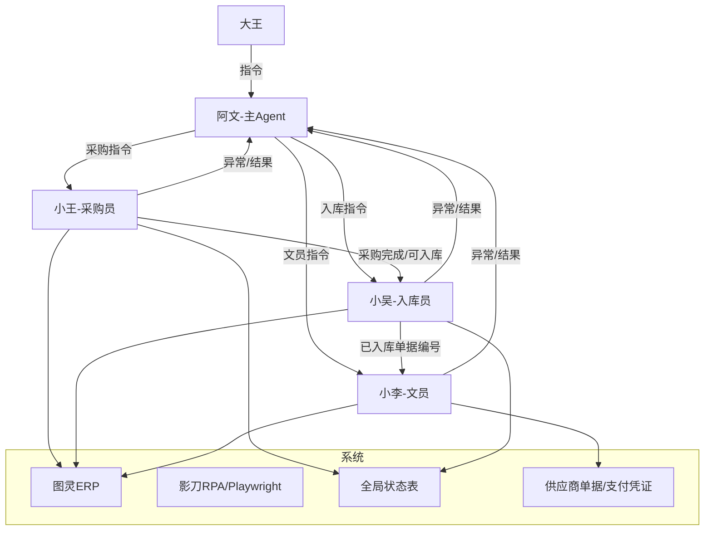

# 多Agent协作

> WorkBuddy 多智能体协同方案。当前统一为：阿文统筹，小王采购，小吴入库，小李文员。

---

## 当前 Agent 架构



---

## Agent 角色定义

### 阿文

- **定位**：主 Agent、军师兼管家。
- **触发**：呼叫"阿文"或"小文"。
- **能力**：思路梳理、技术方案、复盘总结、知识管理、自动化开发、子 Agent 调度。
- **在 ai采购流程中的职责**：发命令、汇总结果、处理异常、给小王/小吴/小李下下一步指令。

### 小王

- **定位**：采购员 Agent。
- **触发**：呼叫"小王"。
- **能力**：接单、下单、供应商微信沟通、回货签收、采购完成、打印标签、版料采购单三表生成。
- **边界**：小王负责采购侧，不负责入库出库，不负责报销上传。

### 小吴

- **定位**：入库员 Agent。
- **触发**：呼叫"小吴"。
- **能力**：全局状态同步、送货入库、待齐套检查、出库、打印 BOM/版单图、确认收货。
- **边界**：小吴负责入库/出库侧，不负责采购下单，不负责报销上传。

### 小李

- **定位**：文员 Agent。
- **触发**：呼叫"小李"。
- **能力**：供应商单据编号整理、支付凭证整理、凭证匹配重命名、报销任务表生成、图灵报销页面上传。
- **边界**：小李负责文员报销侧，不负责采购下单，不负责入库出库。

---

## 合并后的协作模式

```text
大王 -> 阿文 -> 小王/小吴/小李
小王/小吴/小李 -> 异常和结果回流给阿文
阿文 -> 根据异常类型继续下指令
```

不再维护以下重复路线：

- 独立“主Agent”路线：已合并为阿文。
- 独立“采购员Agent”泛称：已合并为小王。
- 独立“文员Agent”泛称：已合并为小李。
- 小王的旧主身份已合并到采购员 Agent；三表生成保留为工具能力。

---

## 关联笔记

- [[系统/WorkBuddy系统|WorkBuddy系统]]
- [[业务/ai采购流程|ai采购流程]]
- [[团队/阿文|阿文]]
- [[团队/小王|小王]]
- [[团队/小吴|小吴]]
- [[团队/小李|小李]]
- [[技术/自动化报销系统|自动化报销系统]]
