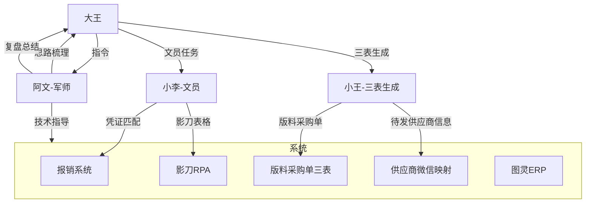

# 多Agent协作

> WorkBuddy多智能体协同方案

---

## 当前Agent架构



---

## Agent角色定义

### 阿文
- **定位**：军师兼管家
- **触发**：呼叫"阿文"或"小文"
- **能力**：思路梳理、技术方案、复盘总结、知识管理、自动化开发

### 小李
- **定位**：文员Agent
- **触发**：呼叫"小李"
- **能力**：凭证匹配重命名、影刀表格生成

### 小王
- **定位**：三表生成Agent
- **触发**：呼叫"小王"
- **能力**：版料采购单生成三表、待发供应商信息、待补联系人
- **入口脚本**：`C:\Users\Administrator\Desktop\版料采购单生成三表_backup_20260602_162549.bat`
- **协作边界**：小王负责三表；小吴负责全局状态表同步

### 其他（规划中）
- **小吴**：全局状态表同步与状态维护（待补完整Agent笔记）

---

## 协作模式

### 当前模式：对话路由
```
大王 → 根据任务类型呼叫不同Agent
Agent → 独立完成任务 → 汇报结果
```

### 目标模式：MCP多Agent协同
```
多个Agent通过MCP协议共享上下文
任务自动分发 → 并行执行 → 结果汇聚
```

---

## 微信群@回复功能（预研）

- 需求：群聊中@Agent即可自动回复
- 方案：MCP + 微信接口
- 状态：调研中

---

## 关联笔记
- [[系统/WorkBuddy系统|WorkBuddy系统]]
- [[团队/阿文|阿文]]
- [[团队/小李|小李]]
- [[团队/小王|小王]]
- [[技术/自动化报销系统|自动化报销系统]]
