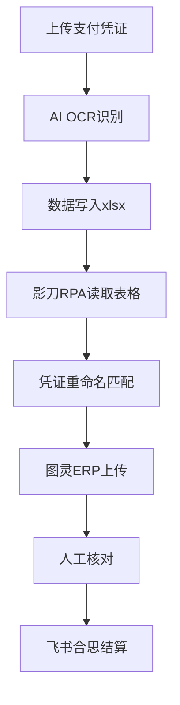

# 自动化报销系统

> 基于Python + Playwright的自动化报销项目

---

## 项目位置

`D:/报销工作台/`

---

## 核心脚本

| 脚本 | 功能 | 状态 |
|------|------|------|
| `clerk_agent.py` | 文员Agent核心，处理凭证匹配 | 维护中 |
| `task_writer.py` | WorkBuddy任务写入 | 维护中 |
| `turing_reimb.py` | 图灵ERP报销处理 | 维护中 |
| `wechat_notify.py` | 微信通知发送 | 规划中 |

---

## 系统流程

---

## 关键逻辑

### 凭证匹配
- 按金额和供应商匹配支付凭证到采购单
- 同金额加后缀，同金额同供应商人工判断
- 详见：[[数据/凭证命名规则|凭证命名规则]]

### 使用部门关联
- 通过采购单号关联创建人
- 创建人 → 使用部门 → 报销单
- 详见：[[数据/使用部门映射|使用部门映射]]

### 月结供应商
- OCR按分段识别，而非按总额
- 映射表需增加结算类型字段

---

## 当前进展

1. ✅ 核心脚本框架建立
2. 🔄 MCP多Agent协同方案调研
3. 🔄 微信@消息自动回复功能预研
4. ⬜ 端到端供应商对账链（订单→报销→结算）

---

## 关联笔记
- [[系统/影刀RPA|影刀RPA]]
- [[技术/多Agent协作|多Agent协作]]
- [[系统/图灵ERP|图灵ERP]]
