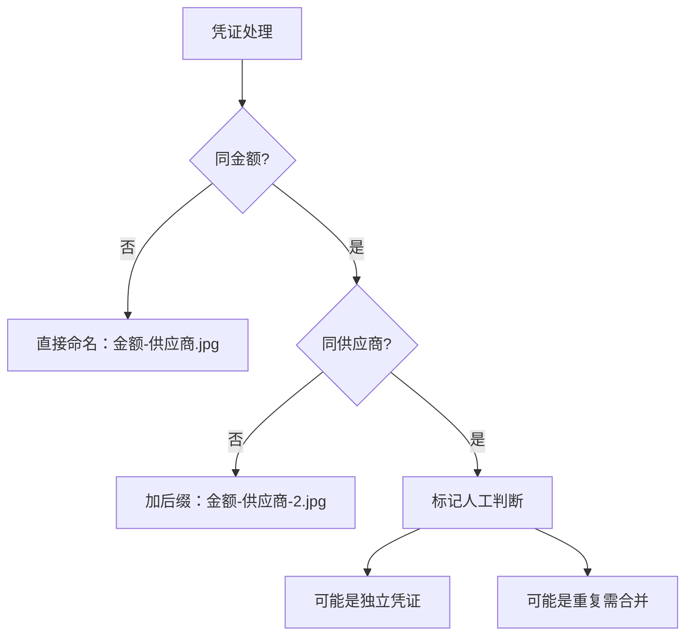

# 凭证命名规则

> 支付凭证图片的重命名规范

---

## 基本规则

格式：`金额-供应商.jpg`

示例：`1300-广信面料店.jpg`

---

## 同金额处理

当存在多张相同金额的凭证时，加后缀区分：

| 文件名 | 说明 |
|--------|------|
| `1300-广信面料店.jpg` | 第1张 |
| `1300-广信面料店-2.jpg` | 第2张 |
| `1300-广信面料店-3.jpg` | 第3张 |

---

## 特殊情况

### 同金额 + 同供应商
- 可能是独立凭证（非重复）
- 需人工判断是否合并或保留独立

---

## 凭证排序规则

上传前按以下优先级排列：
1. 纸张大小：A4为主优先排列
2. 供应商顺序：同纸张大小内按供应商排序

---

## 月结供应商处理

- OCR识别按**分段**而非总额
- 映射表需增加**结算类型**字段

---

## 关联笔记
- [[业务/报销流程|报销流程]]
- [[系统/影刀RPA|影刀RPA]]
- [[团队/小李|小李（凭证匹配执行者）]]
