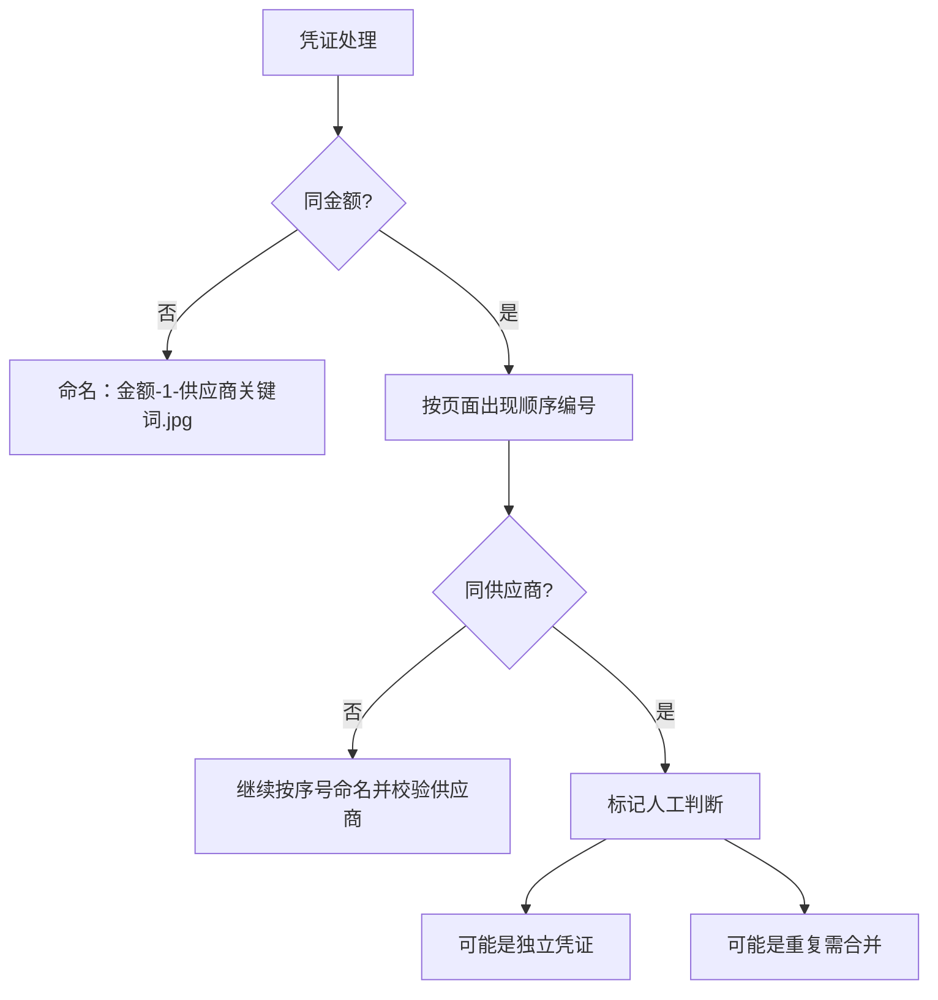

# 凭证命名规则

> 支付凭证图片的权威命名规范。所有报销上传、凭证匹配、小李任务均以本文件为准。

---

## 基本规则

格式：`金额-序号-供应商关键词.jpg`

示例：
- `3-1-NNF.jpg` → 金额3，第1条，NNF拉链
- `3-2-NNF.jpg` → 金额3，第2条，NNF拉链
- `30-1-小米.jpg` → 金额30，第1条，小米纺织

字段说明：

| 字段 | 含义 | 要求 |
|------|------|------|
| 金额 | 图灵ERP页面的入库金额或凭证金额 | 保持页面显示口径，不自行四舍五入 |
| 序号 | 同一金额在当前页面/当前任务中的出现顺序 | 从1开始，按页面从上到下编号 |
| 供应商关键词 | 供应商在凭证文件名中的短关键词 | 以[[供应商列表]]中的“凭证关键词”为准 |

---

## 编号规则

同一任务中，相同金额的凭证必须按出现顺序编号：

| 文件名 | 说明 |
|--------|------|
| `1300-1-广信.jpg` | 金额1300的第1条 |
| `1300-2-广信.jpg` | 金额1300的第2条 |
| `1300-3-广信.jpg` | 金额1300的第3条 |

即使供应商不同，只要金额相同，也先按金额出现顺序编号；供应商关键词用于辅助校验。

---

## 特殊情况

### 同金额 + 同供应商
- 可能是独立凭证（非重复）
- 仍按出现顺序编号
- 需人工判断是否合并或保留独立，处理方式见[[AI执行指南/异常处理决策表|异常处理决策表]]

---

## 凭证排序规则

上传前按以下优先级排列：
1. 图灵ERP页面从上到下的行顺序
2. 同金额按出现顺序编号
3. 供应商关键词用于二次校验
4. 纸张大小和供应商顺序只作为人工整理参考，不作为自动匹配主键

---

## 月结供应商处理

- OCR识别按**分段**而非总额
- [[供应商列表]]中的“结算类型”需标记为“月结”
- 月结凭证不得只按总额匹配，必须按分段金额与采购单逐项核验

---

## 权威性说明

1. 本文件是凭证命名的唯一权威来源
2. 其他文件如出现旧格式 `金额-供应商.jpg` 或 `金额-供应商-2.jpg`，以本文件为准
3. Agent执行报销上传前，必须先读取本文件和[[AI执行指南/Agent读取顺序|Agent读取顺序]]

---

## 关联笔记
- [[业务/报销流程|报销流程]]
- [[系统/影刀RPA|影刀RPA]]
- [[团队/小李|小李（凭证匹配执行者）]]
- [[AI执行指南/凭证匹配决策表|凭证匹配决策表]]
