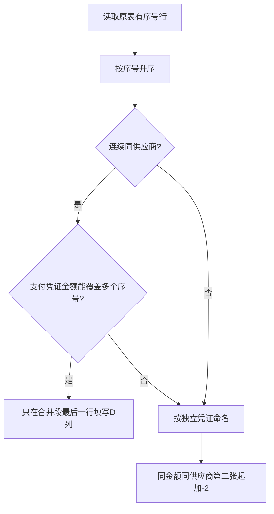

# 凭证命名规则

> 支付凭证图片的权威命名规范。所有报销上传、凭证匹配、小李任务均以本文件为准。

---

## 影刀表格当前规则

> 适用于小李生成影刀数据表格、整理 `D:\ai共享盘\MyBrain\支付凭证` 的任务。

处理顺序必须是：
1. 先读取原始报销表 A 列“序号”
2. 只取原表中有序号的行，按序号升序生成影刀表格
3. 再根据影刀表 D 列“待上传的支付凭证名”修改支付凭证图片名称

影刀表 D 列和支付凭证图片命名格式：`金额-供应商全称`

图片文件名需在 D 列基础上追加扩展名：`金额-供应商全称.jpg`

示例：
- `60-隆发罗纹.jpg`
- `370-优粤纺织.jpg`
- `20-2-怡丰布行.jpg`

当同一金额、同一供应商有多张独立凭证时，第二张起加序号：`金额-2-供应商全称.jpg`。

字段说明：

| 字段 | 含义 | 要求 |
|------|------|------|
| 金额 | 图灵ERP页面的入库金额或凭证金额 | 保持页面显示口径，不自行四舍五入 |
| 序号 | 原始报销表 A 列序号 | 只能读取原表，不能自行生成 |
| 供应商全称 | 影刀表 C 列供应商 | D 列和图片名使用全称 |

---

## 编号规则

同一任务中，同金额同供应商有多张独立凭证时，第二张起在金额后加序号：

| 文件名 | 说明 |
|--------|------|
| `20-怡丰布行.jpg` | 第一张 20 元怡丰布行凭证 |
| `20-2-怡丰布行.jpg` | 第二张 20 元怡丰布行凭证 |

不同供应商各自按供应商全称命名，不按全局金额顺序编号。

---

## 特殊情况

### 多个序号对应一张凭证
- 原表中可能出现两个或多个连续序号金额合并对应同一张支付凭证。
- 影刀表格应在这些序号的最后一行填写 D 列“待上传的支付凭证名”，前面的行 D 列留空。
- 例：序号 18 金额 30、序号 19 金额 30，支付凭证金额为 60，则 D 列只在序号 19 最后一行填写 `60-隆发罗纹`。
- 判断合并时，以支付凭证实际金额和供应商为准，不要机械地按每个序号各生成一张凭证。

### 金额识别校验
- 凭证金额必须以支付截图/OCR/人工确认的实际金额为准。
- 不得只根据 Windows 搜索高亮、文件名相似、缩略图文字猜金额。
- 容易混淆的数字（如 `370` 与 `375`）必须放大查看凭证图或通过 OCR 确认。
- 本次纠错案例：`370-优粤纺织.jpg` 曾被误识别为 `375-优粤纺织.jpg`，导致影刀表把 `370-优粤纺织` 误判为缺凭证，并把该图误判为未使用凭证。

### 同金额 + 同供应商
- 可能是独立凭证（非重复）
- 独立凭证从第二张起使用 `金额-2-供应商全称`
- 需人工判断是否合并或保留独立，处理方式见[[AI执行指南/异常处理决策表|异常处理决策表]]

---

## 凭证排序规则

上传前按以下优先级排列：
1. 原始报销表 A 列序号升序
2. 同一序号内保持原表行顺序
3. 连续同供应商可按支付凭证实际金额合并
4. 纸张大小和供应商顺序只作为人工整理参考，不作为自动匹配主键

---

## 月结供应商处理

- OCR识别按**分段**而非总额
- [[供应商列表]]中的“结算类型”需标记为“月结”
- 月结凭证不得只按总额匹配，必须按分段金额与采购单逐项核验

---

## 权威性说明

1. 本文件是凭证命名的唯一权威来源
2. 其他文件如出现旧格式 `金额-序号-供应商关键词.jpg`，小李影刀表格整理任务一律忽略，以本文件为准
3. Agent执行报销上传前，必须先读取本文件和[[AI执行指南/Agent读取顺序|Agent读取顺序]]

---

## 关联笔记
- [[业务/报销流程|报销流程]]
- [[系统/影刀RPA|影刀RPA]]
- [[团队/小李|小李（凭证匹配执行者）]]
- [[AI执行指南/凭证匹配决策表|凭证匹配决策表]]
