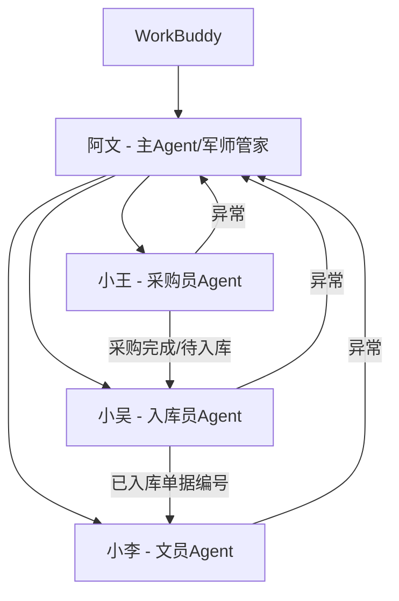

# WorkBuddy系统

> 大王的 AI 工作搭档系统。统一口径：[[团队/阿文|阿文]]是主 Agent，负责调度；[[团队/小王|小王]]是采购员 Agent；[[团队/小吴|小吴]]是入库员 Agent；[[团队/小李|小李]]是文员 Agent。

---

## 系统组成

---

## Agent 角色

### 阿文（主 Agent）

- **触发词**："阿文"、"小文"
- **定位**：主 Agent、军师兼管家。
- **职责**：发命令、做计划、统计结果、处理异常回流、维护知识库。
- **边界**：阿文不替代子 Agent 的具体职责；阿文负责判断下一步指令。

### 小王（采购员 Agent）

- **触发词**："小王"
- **职责**：接单、下单、供应商微信沟通、回货签收、采购完成、打印标签、把可入库采购单交给小吴。
- **工具能力**：采购单下载、待下单批量下单、空采购员转派王国钦、供应商单据识别、采购完成、打印标签尝试、写小吴任务表、版料采购单生成三表、待发供应商信息、待补联系人、无需发送微信供应商识别。
- **说明**：小王的主身份是采购员 Agent；三表生成只是采购员工作中的一个工具能力。

### 小吴（入库员 Agent）

- **触发词**："小吴"
- **职责**：全局状态同步、送货入库、待齐套检查、出库、打印 BOM/版单图、确认收货、把已入库供应商单据编号交给小李。
- **说明**：小吴不是小王的附属步骤，是独立入库员 Agent。

### 小李（文员 Agent）

- **触发词**："小李"
- **职责**：供应商单据编号整理、支付凭证整理、报销任务表生成、图灵版料报销页面创建报销单、添加采购记录、上传支付凭证。

---

## 核心脚本

| 脚本 | 归属 | 功能 |
|------|------|------|
| `D:\报销工作台\03_脚本\xiaowang_agent.py` | 小王 | 采购员 Agent 主入口；下载采购单；待下单批量下单；供应商单据识别；待收货优先采购完成；打印标签尝试；写小吴任务表 |
| `D:\app\自动化流程\版料采购单生成三表.py` | 小王 | 生成版料采购单三表、待发供应商信息、待补联系人；识别无需发送微信供应商 |
| `C:\Users\Administrator\Desktop\版料采购单生成三表_backup_20260602_162549.bat` | 小王/小吴 | 先执行小王三表生成，再执行小吴全局状态同步 |
| `D:\app\自动化流程\版料采购到货处理.py` | 小王 | 到货清单与供应商价格表匹配，生成到货处理文件 |
| `D:\报销工作台\03_脚本\xiaowu_agent.py` | 小吴 | 入库员 Agent 主入口，目前是骨架 |
| `D:\报销工作台\03_脚本\sync_xiaowu_global_status.py` | 小吴 | 同步全局状态表的图灵采购明细表 |
| `C:\Users\Administrator\.workbuddy\skills\yingdao-rpa\purchase_auto_inbound.py` | 小吴 | 送货入库页面搜索采购编号并点击入库确认 |
| `D:\报销工作台\03_脚本\clerk_agent.py` | 小李 | 文员批量报销主脚本 |
| `D:\报销工作台\03_脚本\turing_reimb.py` | 小李 | 图灵版料报销页面 Playwright 封装 |
| `D:\报销工作台\03_脚本\task_writer.py` | 小李 | WorkBuddy 报销任务表读取与回写 |
| `C:\Users\Administrator\.workbuddy\skills\yingdao-rpa\expense_reimbursement.py` | 小李 | 报销复刻脚本，作为参考/备用 |

---

## ai采购流程

- 主项目笔记：[[业务/ai采购流程|ai采购流程]]
- 调度者：[[团队/阿文|阿文]]
- 子 Agent：[[团队/小王|小王]]、[[团队/小吴|小吴]]、[[团队/小李|小李]]
- 当前状态：数据底座和小李报销链路较完整；小王已具备采购单下载、无需发送微信识别、待下单批量下单、空采购员转派、供应商单据扫描、采购完成入口、小吴任务表写入能力；小王微信发送、小吴齐套出库动作、阿文统一调度仍需开发。

---

## WorkBuddy RPA 复刻维护

- 技能目录：`C:\Users\Administrator\.workbuddy\skills\yingdao-rpa`
- 入库复刻脚本：`purchase_auto_inbound.py`
- 报销复刻脚本：`expense_reimbursement.py`
- 当前维护要求：连接已登录浏览器、等待有超时、失败有清单、提交前必须拦截失败项。
- 详细记录：[[技术/WorkBuddy RPA复刻审查|WorkBuddy RPA复刻审查]]

---

## 关联笔记

- [[团队/阿文|阿文]]
- [[团队/小王|小王]]
- [[团队/小吴|小吴]]
- [[团队/小李|小李]]
- [[业务/ai采购流程|ai采购流程]]
- [[技术/多Agent协作|多Agent协作]]
- [[技术/自动化报销系统|自动化报销系统]]
