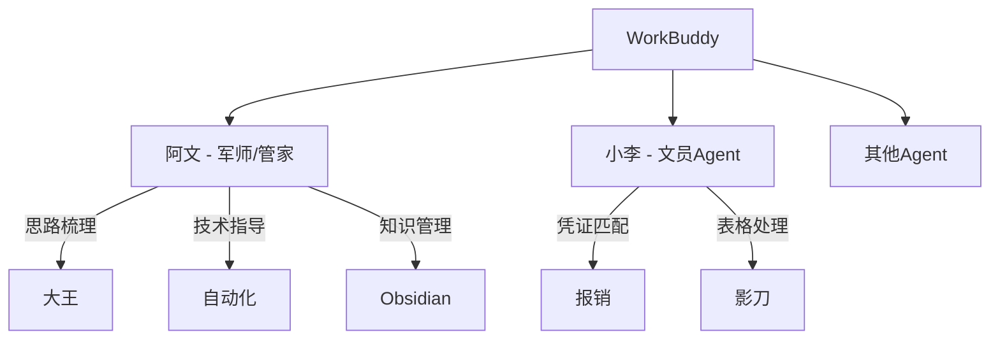

# WorkBuddy系统

> 大王的AI工作搭档系统，包含军师阿文和文员小李等Agent

---

## 系统组成

---

## Agent角色

### 阿文（军师兼管家）
- **触发词**："阿文"、"小文"
- **职责**：思路梳理、技术指导、复盘总结、知识管理
- **风格**：温和直接，像军师给主公汇报

### 小李（文员Agent）
- **触发词**："小李"
- **职责**：凭证匹配重命名、影刀表格生成

---

## WorkBuddy任务系统

### 采购入库任务
结构化任务处理，含校验节点：
1. 采购单号
2. 供应商
3. 状态
4. 物料
5. 颜色

任务文件位置：`D:/报销工作台/04_WorkBuddy任务/`

---

## 核心脚本

| 脚本 | 功能 |
|------|------|
| `clerk_agent.py` | 文员Agent核心脚本 |
| `task_writer.py` | WorkBuddy任务写入 |
| `turing_reimb.py` | 图灵报销处理 |
| `wechat_notify.py` | 微信通知 |

---

## 当前探索方向

- MCP多智能体协同方案
- 微信群@消息自动回复AI功能
- 端到端供应商对账链（订单→报销）
- 面料二维码BOM核对轻量方案

---

## 关联笔记
- [[团队/阿文|阿文]]
- [[团队/小李|小李]]
- [[技术/多Agent协作|多Agent协作]]
- [[技术/自动化报销系统|自动化报销系统]]
